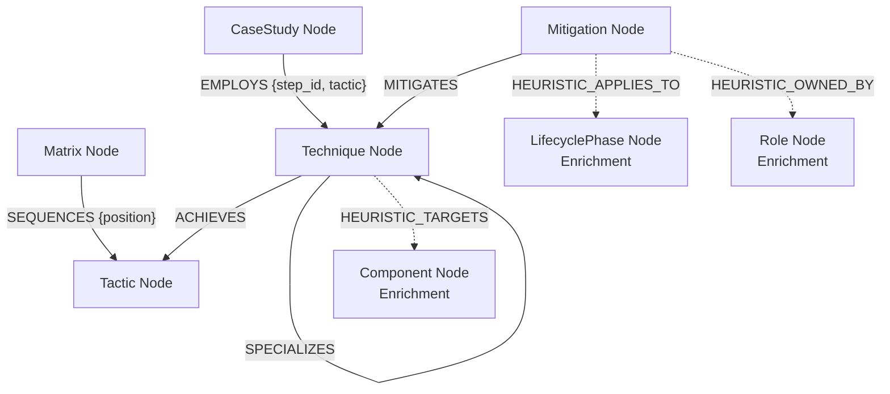

# MITRE ATLAS Knowledge Graph (Neo4j)

A production-grade, graph-native implementation of the **MITRE ATLAS (Adversarial Threat Landscape for AI Systems)** framework.

This project ingests official MITRE ATLAS data (tactics, techniques, mitigations, and case studies) from YAML into a Neo4j Graph Database, layers on heuristic security engineering enrichments (system components, organizational roles, lifecycle phases), and exposes a multi-hop query analysis interface.

---

## Graph Schema Architecture

The knowledge graph models the official MITRE taxonomy alongside heuristic enrichments. Official relationships preserve the original MITRE direction semantics. Heuristics are explicitly separated with a `HEURISTIC_` prefix.



---

## Project Structure

*   `build_kg.py`: Core ingestion pipeline. Establishes constraints/indexes, parses YAML, runs high-performance batched `UNWIND` transactions, and validates node/relationship loading.
*   `demo_queries.py`: Multi-hop query command-line interface. Runs 10 advanced graph traversal queries (including RAG threat-analysis and security gap assessments) formatted in premium console grids.
*   `config.py`: Centralized configuration module. Handles environment variable parsing and heuristic classification taxonomies.
*   `requirements.txt`: Python package dependencies.
*   `.env.example`: Template for configuring Neo4j connection credentials.
*   `REPORT.md`: Comprehensive engineering report detailing design decisions, performance benchmarks, and query methodologies.

---

## Setup & Execution

### 1. Prerequisites

*   **Python 3.8+**
*   **Neo4j Instance** (or Docker to run it locally)

### 2. Start Neo4j (via Docker)

If you don't have Neo4j running, you can start a local instance using Docker:

```bash
docker run -d \
  --name mitre-neo4j \
  -p 7474:7474 \
  -p 7687:7687 \
  -e NEO4J_AUTH=neo4j/password \
  neo4j:5.12.0
```

*   **Neo4j Browser (HTTP)**: [http://localhost:7474](http://localhost:7474) (Username: `neo4j`, Password: `password`)
*   **Bolt Protocol Port**: `bolt://localhost:7687`

### 3. Python Environment Setup

Install project dependencies:

```bash
pip install -r requirements.txt
```

Configure environment credentials by copying the example environment template:

```bash
cp .env.example .env
```

Open `.env` and adjust credentials if they differ from default settings:
```ini
NEO4J_URI=bolt://localhost:7687
NEO4J_USER=neo4j
NEO4J_PASSWORD=password
ATLAS_YAML_PATH=ATLAS-latest.yaml
```

---

## Usage Guidelines

### 1. Ingest ATLAS Data
Execute the builder script to load tactics, techniques, mitigations, and case studies:

```bash
python build_kg.py
```

To clean the database (drop all existing nodes and relationships) before starting a fresh ingestion:

```bash
python build_kg.py --clean
```

Upon completion, the builder prints a structured validation table checking that database counts align with parsed YAML metrics.

### 2. Run Analytics
Execute the query interface to explore the graph and extract insights.

To list descriptions of all 10 available demonstration queries:
```bash
python demo_queries.py --list
```

To run a specific query by its identifier (e.g., Query 1, which answers the RAG-inference/application-developer question from the brief):
```bash
python demo_queries.py --query 1
```

To run all 10 analytics queries in sequence:
```bash
python demo_queries.py --all
```
