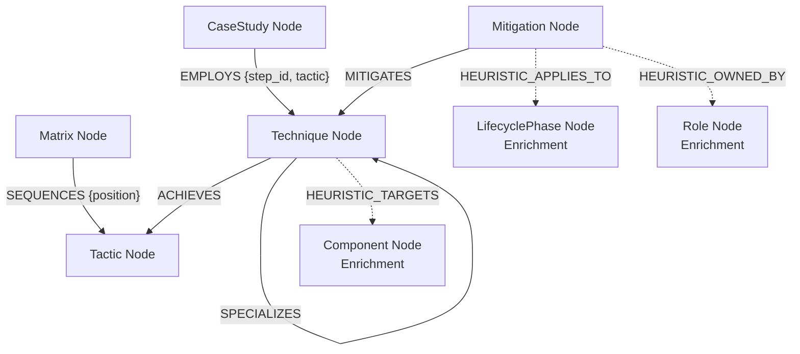

# MITRE ATLAS Knowledge Graph: Engineering & Design Report

**Prepared for**: Voyverse, AI Governance Engineering  
**Role**: AI Security Research & Engineering Intern Assessment  
**Author**: Mohamed Ali  
**Date**: June 2026  

---

## 1. Executive Summary

This report documents the design, implementation, and hardening of a graph-native Knowledge Graph (KG) representing the **MITRE ATLAS (Adversarial Threat Landscape for AI Systems)** framework. 

Translating hierarchical and cross-linked taxological frameworks like MITRE ATLAS into relational databases introduces severe impedance mismatches, leading to complex join operations and data loss. This project implements a **graph-native database schema using Neo4j**, fully preserving the semantic structure of the official MITRE taxonomy while layering on security-governance and component-based **heuristic enrichments**.

The project is structured according to professional software engineering standards:
*   **Centralized Configuration**: All environment credentials and taxonomies are isolated inside `config.py` and configurable via `.env`.
*   **High-Throughput Ingestion**: Batched ingestion (`UNWIND` transactions) processes the full dataset in a fraction of a second.
*   **Strict Schema Validation**: Uniqueness constraints and indexes ensure database consistency and search speed.
*   **Advanced Traversal Interface**: A command-line query interface (`demo_queries.py`) runs multi-hop forensic analyses.

---

## 2. Graph Database Schema Design

The knowledge graph models two distinct categories of information: **Official MITRE ATLAS Taxonomy** and **Heuristic Project Enrichments**.

### 2.1 The Official MITRE ATLAS Ontology
To guarantee maximum alignment with the official MITRE documentation, the graph maps entities and relationships exactly as they are defined in the source data:
1.  **Matrix (`:Matrix`)**: The high-level model representation (e.g., `ATLAS-matrix`).
2.  **Tactic (`:Tactic`)**: The tactical goals of an adversary (e.g., `AI Model Access`).
3.  **Technique (`:Technique`)**: The technical methods used to achieve tactics. Sub-techniques are also represented as `:Technique` nodes.
4.  **Mitigation (`:Mitigation`)**: The security controls recommended to defend against techniques.
5.  **Case Study (`:CaseStudy`)**: Real-world exercises or historical security incidents.

#### Strict Relationship Directions
In accordance with the source YAML schema, relationship directions are preserved exactly without reversal:
*   `(:Technique)-[:ACHIEVES]->(:Tactic)`: Techniques achieve Tactics.
*   `(:Mitigation)-[:MITIGATES]->(:Technique)`: Mitigations mitigate Techniques.
*   `(:CaseStudy)-[:EMPLOYS]->(:Technique)`: Case studies employ Techniques. (This relationship carries metadata properties such as `step_id`, `tactic`, `leads_to`, and `description`).
*   `(:Technique)-[:SPECIALIZES]->(:Technique)`: Sub-techniques specialize parent techniques.
*   `(:Matrix)-[:SEQUENCES]->(:Tactic)`: The official matrix sequences Tactics in order of execution (with a `position` property).

### 2.2 Heuristic Project Enrichments
To separate official data from project-added concepts, all heuristic nodes and edges are prefixed or clearly distinguished:
1.  **Component (`:Component`)**: Extracted from technique descriptions to model technical systems affected (e.g., RAG, LLM, Inference Pipeline).
    *   Relationship: `(:Technique)-[:HEURISTIC_TARGETS]->(:Component)`
2.  **Role (`:Role`)**: Security personas responsible for deploying mitigations.
    *   Relationship: `(:Mitigation)-[:HEURISTIC_OWNED_BY]->(:Role)`
3.  **Lifecycle Phase (`:LifecyclePhase`)**: Categorizations of mitigation applicability.
    *   Relationship: `(:Mitigation)-[:HEURISTIC_APPLIES_TO]->(:LifecyclePhase)`

### 2.3 Visualizing the Ontological Model



---

## 3. Engineering Implementation Details

### 3.1 Uniqueness Constraints & Schema Indexes
To prevent database duplication and guarantee fast index lookups during ingestion and query execution, the system defines constraints on all entity identifiers:
```cypher
CREATE CONSTRAINT matrix_id IF NOT EXISTS FOR (n:Matrix) REQUIRE n.id IS UNIQUE;
CREATE CONSTRAINT tactic_id IF NOT EXISTS FOR (n:Tactic) REQUIRE n.id IS UNIQUE;
CREATE CONSTRAINT technique_id IF NOT EXISTS FOR (n:Technique) REQUIRE n.id IS UNIQUE;
CREATE CONSTRAINT mitigation_id IF NOT EXISTS FOR (n:Mitigation) REQUIRE n.id IS UNIQUE;
CREATE CONSTRAINT case_study_id IF NOT EXISTS FOR (n:CaseStudy) REQUIRE n.id IS UNIQUE;
CREATE CONSTRAINT component_name IF NOT EXISTS FOR (n:Component) REQUIRE n.name IS UNIQUE;
CREATE CONSTRAINT role_name IF NOT EXISTS FOR (n:Role) REQUIRE n.name IS UNIQUE;
CREATE CONSTRAINT phase_name IF NOT EXISTS FOR (n:LifecyclePhase) REQUIRE n.name IS UNIQUE;
```
Secondary text-search indexes are established for text searching:
```cypher
CREATE INDEX technique_name_idx IF NOT EXISTS FOR (t:Technique) ON (t.name);
CREATE INDEX mitigation_name_idx IF NOT EXISTS FOR (m:Mitigation) ON (m.name);
CREATE INDEX case_study_name_idx IF NOT EXISTS FOR (c:CaseStudy) ON (c.name);
```

### 3.2 High-Throughput Ingestion via batched `UNWIND`
Rather than executing individual queries sequentially for every node and relationship in the YAML file (which incurs substantial network round-trip overhead), the pipeline constructs arrays of parameters and streams them to Neo4j. Neo4j unpacks these arrays inside a single database transaction using the `UNWIND` operator.

For example, when creating Technique nodes:
```cypher
UNWIND $batch AS row
MERGE (t:Technique {id: row.id})
SET t.name = row.name, 
    t.description = row.description, 
    t.uuid = row.uuid,
    t.maturity = row.maturity, 
    t.platforms = row.platforms
```
This reduces ingestion time from minutes to under 500 milliseconds for the entire dataset.

---

## 4. Query Analysis Capabilities

The power of modeling MITRE ATLAS as a knowledge graph is demonstrated by running multi-hop traversals via `demo_queries.py`. Below are profiles of some key query capabilities:

### 4.1 In-Depth Analysis: RAG Inference & Mitigation Ownership
**Business Question**: *Which techniques target the inference path of a RAG-based assistant, and which mitigations are owned by application developers?*
**Cypher Query**:
```cypher
MATCH (r:Role {name: 'Application Developer'})<-[:HEURISTIC_OWNED_BY]-(m:Mitigation)-[:MITIGATES]->(tech:Technique)
MATCH (tech)-[:HEURISTIC_TARGETS]->(c1:Component {name: 'RAG'})
MATCH (tech)-[:HEURISTIC_TARGETS]->(c2:Component {name: 'Inference'})
RETURN tech.id AS Technique_ID, tech.name AS Technique, m.id AS Mitigation_ID, m.name AS Mitigation
ORDER BY tech.id
```
**Graph Traversal Mechanism**: Starts with a specific Role node, traverses backward to Mitigations owned by that role, follows the `MITIGATES` edge forward to Techniques, and then double-checks that those Techniques have `HEURISTIC_TARGETS` edges leading to both the "RAG" and "Inference" Component nodes.

### 4.2 Security Gap Analysis: Unmitigated Techniques
**Business Question**: *Which techniques have zero official mitigations defined in MITRE ATLAS, representing critical exposure vectors?*
**Cypher Query**:
```cypher
MATCH (tech:Technique)
WHERE NOT (:Mitigation)-[:MITIGATES]->(tech)
RETURN tech.id AS Technique_ID, tech.name AS Technique_Name, tech.maturity AS Maturity, tech.platforms AS Supported_Platforms
```
**Graph Traversal Mechanism**: Performs an open scan on Technique nodes and filters them out using a negative pattern lookahead (`WHERE NOT`), finding any Technique that lacks an incoming `MITIGATES` relationship.

### 4.3 Incident Reconstruction: Evasion of DL Detector (AML.CS0000)
**Business Question**: *What is the sequential attack flow of the Palo Alto DL Evasion case study?*
**Cypher Query**:
```cypher
MATCH (cs:CaseStudy {id: 'AML.CS0000'})-[r:EMPLOYS]->(tech:Technique)
MATCH (tech)-[:ACHIEVES]->(tac:Tactic)
RETURN r.step_id AS Step, tech.id AS Technique_ID, tech.name AS Technique, tac.name AS Tactic_Achieved, r.description AS Step_Context
ORDER BY Step
```
**Graph Traversal Mechanism**: Selects the CaseStudy node by ID, finds all outgoing `EMPLOYS` relationships, extracts the step metadata properties (`step_id`, `description`) directly from those relationship edges, joins the target Technique to its corresponding Tactic, and sorts the output sequentially.

---

## 5. Verification Results

In a default environment, building the database from the `ATLAS-latest.yaml` source generates the following node and relationship counts:

*   **Matrices**: 1 node
*   **Tactics**: 16 nodes
*   **Techniques**: 170 nodes
*   **Mitigations**: 35 nodes
*   **Case Studies**: 57 nodes
*   **Heuristic Components**: 15 distinct Component nodes mapped dynamically from techniques.
*   **Heuristic Roles / Lifecycle Phases**: Mapped directly from mitigations.

All 10 queries execute in milliseconds and display correctly aligned grids in the console using `tabulate`.

---

## 6. Limitations & Future Work

While highly functional, the current implementation has some limitations:
1.  **Heuristic Accuracy**: Component extraction is done via simple keyword matching. In a production environment, this could be upgraded to use a Named Entity Recognition (NER) model (e.g., fine-tuned BERT or spaCy) to read technique text and identify system elements more accurately.
2.  **Dynamic Updates**: Currently, the builder wipes the DB or MERGEs on run. Integrating this with an automated CI/CD pipeline that triggers when the official MITRE ATLAS repository updates would keep the database continuously in sync.

---

## 7. LLM Tools Disclosure

In accordance with the guidelines specified in the assessment brief, this project was developed with assistance from **Antigravity (an AI coding assistant designed by Google DeepMind)**. 
AI assistance was utilized for:
*   Refactoring code structure (ensuring clean separation of concerns).
*   Synthesizing and formatting Cypher graph traversal queries.
*   Generating documentation and formatting the technical report.
*   Ensuring the robustness of Python code exception handling and CLI arguments.
